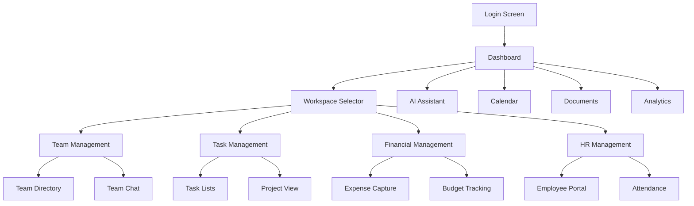
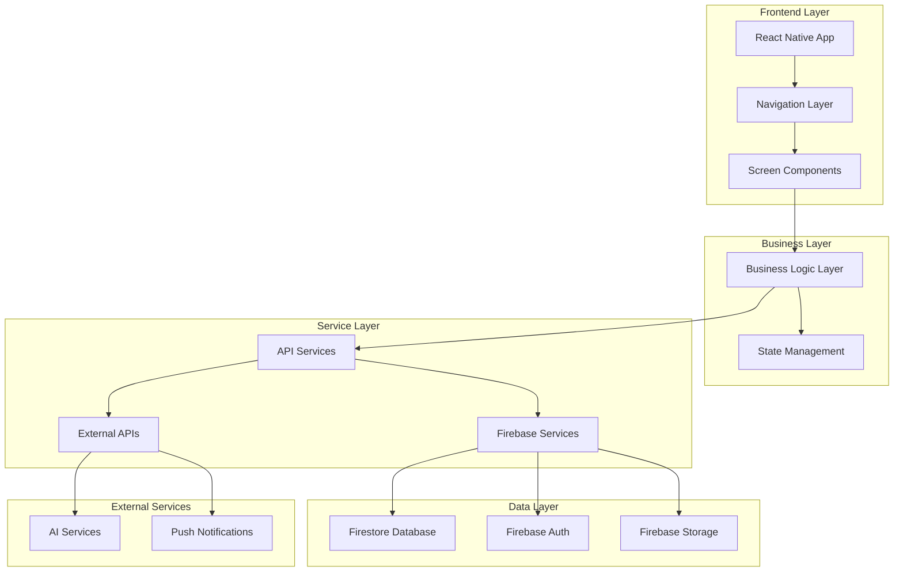
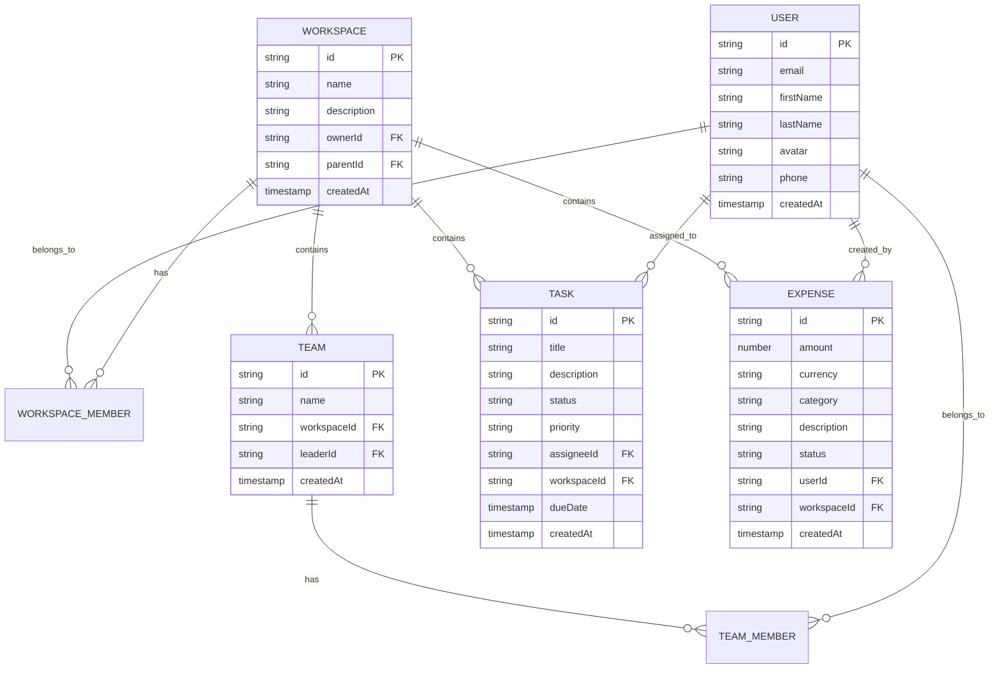

# 📱 SPT Teams Mobile App - Product Requirements Document (PRD)

## 1. Product Overview

SPT Teams Mobile is a comprehensive React Native application that brings the full power of the enterprise-grade SPT Teams workspace management platform to mobile devices. The app provides seamless access to hierarchical multi-workspace management, advanced RBAC, financial management, HR operations, team collaboration, and AI-powered insights - all optimized for mobile-first experiences.

The mobile app addresses the critical need for on-the-go access to enterprise workspace management, enabling teams to collaborate, manage, and grow their organizations from anywhere with enterprise-grade security and AI-driven intelligence. Target market includes small to medium enterprises (10-500 employees) and large enterprises with distributed teams, representing a $12B+ serviceable addressable market in mobile enterprise applications.

## 2. Core Features

### 2.1 User Roles

| Role | Registration Method | Core Permissions |
|------|---------------------|------------------|
| Owner | Email registration + workspace creation | Full system access, cross-workspace management, all financial/HR operations |
| Admin | Invitation by Owner | Workspace administration, user management, department oversight |
| Member | Invitation by Owner/Admin | Standard access, task management, expense submission, limited reporting |

### 2.2 Feature Module

Our SPT Teams Mobile app consists of the following essential pages:

1. **Authentication & Onboarding**: Multi-factor authentication, biometric login, user onboarding flow
2. **Dashboard**: Unified workspace overview, quick actions, activity feed, AI insights
3. **Workspace Management**: Hierarchical workspace navigation, workspace switching, cross-workspace analytics
4. **Team Management**: Team directory, collaboration tools, performance metrics, communication
5. **Task & Project Management**: Task assignment, project timelines, calendar integration, progress tracking
6. **Financial Management**: Expense capture, budget tracking, financial analytics, approval workflows
7. **HR Management**: Employee directory, recruitment, attendance, leave management, payroll
8. **Document Management**: File sharing, folder structure, version control, collaborative editing
9. **Analytics & Reporting**: Custom dashboards, report builder, data visualization, export capabilities
10. **AI Assistant**: Natural language queries, predictive analytics, smart recommendations
11. **Calendar & Scheduling**: Event management, meeting scheduling, resource booking
12. **Communication Hub**: Messaging, notifications, video calls, team chat
13. **Settings & Profile**: User preferences, security settings, workspace configuration

### 2.3 Page Details

| Page Name | Module Name | Feature Description |
|-----------|-------------|---------------------|
| Authentication | Login/Register | Multi-factor authentication with email/password, Google OAuth, biometric login (Face ID/Touch ID), guest access, password reset |
| Authentication | Onboarding | Welcome flow, workspace setup, role assignment, feature introduction, tutorial walkthrough |
| Dashboard | Overview | Workspace summary cards, recent activity feed, pending approvals, quick action buttons, AI-powered insights |
| Dashboard | Quick Actions | Create task, submit expense, schedule meeting, start video call, access AI assistant |
| Workspace Management | Hierarchy View | Visual workspace tree, parent-child relationships, workspace switching, cross-workspace data aggregation |
| Workspace Management | Analytics | Workspace performance metrics, user activity, financial summaries, team productivity |
| Team Management | Directory | Employee profiles with photos, contact information, roles, department assignments |
| Team Management | Collaboration | Team chat, file sharing, @mentions, video calls, screen sharing |
| Task Management | Task Lists | Personal tasks, team tasks, project tasks with priority levels, due dates, status tracking |
| Task Management | Project View | Gantt charts, project timelines, milestone tracking, resource allocation, progress visualization |
| Financial Management | Expense Capture | Camera receipt scanning, OCR processing, expense categorization, multi-currency support |
| Financial Management | Budget Tracking | Department budgets, cost center analytics, spending alerts, variance analysis |
| Financial Management | Approvals | Expense approval workflows, budget requests, financial reporting, audit trails |
| HR Management | Employee Portal | Employee directory, organizational chart, performance tracking, employee analytics |
| HR Management | Recruitment | Job posting, candidate tracking, interview scheduling, hiring pipeline |
| HR Management | Attendance | Mobile clock-in/out, location verification, break tracking, attendance reports |
| HR Management | Leave Management | Leave requests, balance tracking, approval workflows, calendar integration |
| HR Management | Payroll | Salary management, payslip generation, payroll processing, tax calculations |
| Document Management | File Browser | Hierarchical folder structure, file upload/download, search functionality, recent files |
| Document Management | Collaboration | Document sharing, version control, commenting, real-time editing, approval workflows |
| Analytics | Dashboard | Customizable widgets, real-time metrics, interactive charts, KPI tracking |
| Analytics | Report Builder | Drag-and-drop interface, custom templates, scheduled reports, multi-format export |
| AI Assistant | Chat Interface | Natural language queries, contextual responses, data insights, smart recommendations |
| AI Assistant | Insights | Predictive analytics, trend analysis, performance optimization, automated reports |
| Calendar | Event Management | Personal/team calendars, meeting scheduling, recurring events, reminder notifications |
| Calendar | Resource Booking | Meeting room booking, equipment scheduling, availability checking, conflict resolution |
| Communication | Messaging | Direct messages, group chats, channel communication, file sharing, message threading |
| Communication | Video Calls | One-on-one calls, group meetings, screen sharing, recording, integration with calendar |
| Settings | Profile | Personal information, avatar upload, contact details, notification preferences |
| Settings | Security | Password change, MFA setup, device management, session control, privacy settings |
| Settings | Workspace Config | Workspace settings, role management, permission configuration, integration setup |

## 3. Core Process

### Owner Flow
1. **Authentication**: Login with credentials or biometric authentication
2. **Workspace Overview**: Access unified dashboard showing all workspaces and sub-workspaces
3. **Cross-Workspace Management**: Switch between workspaces, view aggregated analytics, manage hierarchical structure
4. **Team Oversight**: Monitor team performance across all workspaces, assign roles, manage permissions
5. **Financial Control**: Review budgets, approve expenses, analyze financial performance, generate reports
6. **Strategic Decision Making**: Access AI insights, review analytics, make data-driven decisions

### Admin Flow
1. **Authentication**: Login and access assigned workspace(s)
2. **Workspace Management**: Manage users, teams, and departments within workspace
3. **Operational Tasks**: Process approvals, manage projects, oversee team activities
4. **Reporting**: Generate workspace reports, monitor KPIs, track performance metrics
5. **Team Leadership**: Assign tasks, conduct meetings, facilitate collaboration

### Member Flow
1. **Authentication**: Login and access personal workspace
2. **Daily Tasks**: View assigned tasks, update progress, collaborate with team members
3. **Expense Management**: Capture receipts, submit expenses, track reimbursements
4. **Communication**: Participate in team chats, attend meetings, share files
5. **Self-Service**: Request leave, update profile, access company documents



## 4. User Interface Design

### 4.1 Design Style

- **Primary Colors**: Deep maroon (#8A0F3C) for primary actions, bright crimson (#CF163C) for accents
- **Brand Colors**: Indigo (#6366f1), cyan (#22d3ee), orange (#f59e42), rose (#f43f5e), emerald (#10b981) for various UI elements
- **Secondary Colors**: Enhanced gray scale with better contrast, muted backgrounds for cards
- **Button Style**: Rounded corners (0.5rem radius), elevated shadows with glass morphism effects, gradient hover states
- **Typography**: System font stack with enhanced readability, responsive text sizing
- **Layout Style**: Card-based design with enhanced shadows, glass morphism effects, backdrop blur, custom scrollbars with brand gradients
- **Icons**: Lucide React icon set, 24px standard size, consistent stroke width
- **Animations**: Smooth transitions (300ms), spring animations for interactions, loading skeletons, voice wave animations

### 4.2 Page Design Overview

| Page Name | Module Name | UI Elements |
|-----------|-------------|-------------|
| Authentication | Login Form | Glass morphism card with backdrop blur, maroon gradient background, biometric button with crimson accent, enhanced shadows |
| Dashboard | Overview Cards | Enhanced card grid with glass effects, maroon/crimson color coding, custom scrollbars, stats cards with gradient backgrounds |
| Workspace Management | Hierarchy Tree | Card-enhanced expandable tree, workspace icons with brand colors, hover states with enhanced shadows |
| Task Management | Task Lists | Interactive cards with glass morphism, priority indicators using brand color palette, floating action buttons with crimson accent |
| Financial Management | Expense Capture | Full-screen overlay with enhanced card containers, maroon accent borders, glass morphism receipt preview cards |
| HR Management | Employee Directory | Enhanced card grid with backdrop blur, avatar cards with hover effects, role badges using brand color system |
| Document Management | File Browser | Card-elevated containers, glass morphism folder cards, enhanced hover states, custom scrollbar styling |
| Analytics | Dashboard | Chart containers with enhanced shadows, glass morphism metric cards, maroon/crimson chart color scheme |
| AI Assistant | Chat Interface | Glass morphism message bubbles, enhanced card backgrounds, voice wave animations, crimson accent buttons |
| Calendar | Event View | Card-enhanced calendar grid, event cards with brand colors, glass morphism overlays for event details |
| Communication | Chat Interface | Enhanced message cards with backdrop blur, file preview cards with shadows, video call cards with brand styling |
| Settings | Profile Form | Card-enhanced sections with glass effects, enhanced toggle switches, action sheets with brand color accents |

### 4.3 Responsiveness

The mobile app is designed with a mobile-first approach, optimized for smartphones (375px-414px width) with tablet adaptation (768px+ width). Touch interactions are optimized with minimum 44px touch targets, haptic feedback for actions, and gesture-based navigation including swipe-to-go-back, pull-to-refresh, and long-press context menus.

## 5. Technical Architecture

### 5.1 Architecture Design



### 5.2 Technology Description

- **Frontend**: React Native 0.73+ with TypeScript 5.0+, React Navigation 6 for navigation, React Query for server state management
- **State Management**: Zustand for global state, React Context for theme/auth, AsyncStorage for persistence
- **UI Framework**: NativeBase or Tamagui for component library, React Native Reanimated for animations
- **Backend**: Firebase (Firestore, Auth, Storage, Cloud Functions), Google Generative AI for AI features
- **Development Tools**: Expo CLI for development, Flipper for debugging, ESLint + Prettier for code quality

### 5.3 Route Definitions

| Route | Purpose |
|-------|---------|
| /auth/login | User authentication and login |
| /auth/register | New user registration |
| /auth/onboarding | First-time user setup |
| /dashboard | Main dashboard and overview |
| /workspaces | Workspace management and switching |
| /teams | Team directory and collaboration |
| /tasks | Task and project management |
| /financial | Financial management and expenses |
| /hr | Human resources management |
| /documents | Document management and sharing |
| /analytics | Analytics dashboard and reports |
| /ai-assistant | AI assistant and insights |
| /calendar | Calendar and scheduling |
| /communication | Messaging and video calls |
| /settings | User settings and preferences |
| /profile | User profile management |

### 5.4 API Definitions

#### 5.4.1 Core API

**Authentication**
```
POST /api/auth/login
POST /api/auth/register
POST /api/auth/refresh
POST /api/auth/logout
```

**Workspace Management**
```
GET /api/workspaces
POST /api/workspaces
GET /api/workspaces/:id
PUT /api/workspaces/:id
DELETE /api/workspaces/:id
```

**Task Management**
```
GET /api/tasks
POST /api/tasks
PUT /api/tasks/:id
DELETE /api/tasks/:id
```

**Financial Management**
```
GET /api/expenses
POST /api/expenses
PUT /api/expenses/:id/approve
GET /api/budgets
```

### 5.5 Data Model

#### 5.5.1 Data Model Definition



#### 5.5.2 Data Definition Language

**Users Collection**
```javascript
// Firestore collection: users
{
  id: "user_uuid",
  email: "user@example.com",
  firstName: "John",
  lastName: "Doe",
  avatar: "https://storage.url/avatar.jpg",
  phone: "+1234567890",
  preferences: {
    theme: "light",
    notifications: true,
    language: "en"
  },
  createdAt: Timestamp,
  updatedAt: Timestamp
}
```

**Workspaces Collection**
```javascript
// Firestore collection: workspaces
{
  id: "workspace_uuid",
  name: "Main Company",
  description: "Primary workspace",
  ownerId: "user_uuid",
  parentId: null, // or parent workspace ID
  settings: {
    currency: "USD",
    timezone: "America/New_York",
    features: ["financial", "hr", "tasks"]
  },
  createdAt: Timestamp,
  updatedAt: Timestamp
}
```

**Tasks Collection**
```javascript
// Firestore collection: tasks
{
  id: "task_uuid",
  title: "Complete project proposal",
  description: "Detailed description",
  status: "in_progress", // todo, in_progress, review, done
  priority: "high", // low, medium, high, urgent
  assigneeId: "user_uuid",
  assignerId: "user_uuid",
  workspaceId: "workspace_uuid",
  projectId: "project_uuid",
  dueDate: Timestamp,
  tags: ["proposal", "urgent"],
  createdAt: Timestamp,
  updatedAt: Timestamp
}
```

## 6. Mobile-Specific Features

### 6.1 Native Mobile Capabilities

- **Camera Integration**: Receipt scanning for expenses, document capture, profile photo updates, QR code scanning
- **Location Services**: Location-based attendance tracking, geofenced check-ins, branch location verification
- **Biometric Authentication**: Face ID, Touch ID, fingerprint authentication for secure access
- **Push Notifications**: Real-time notifications for tasks, approvals, messages, calendar events
- **Offline Functionality**: Offline task creation, cached document viewing, sync when online
- **Device Integration**: Contact sync, calendar integration, photo library access, haptic feedback

### 6.2 Performance Optimization

- **Lazy Loading**: Screen-based code splitting, image lazy loading, component-level optimization
- **Caching Strategy**: API response caching, image caching, offline data persistence
- **Background Sync**: Automatic data synchronization when app becomes active
- **Memory Management**: Efficient list rendering with FlatList, image optimization, memory leak prevention

## 7. Development Roadmap

### Phase 1: Foundation (Months 1-3)
- Project setup and development environment
- Authentication and security implementation
- Basic navigation and workspace management
- Core UI components and design system

### Phase 2: Core Features (Months 4-6)
- Task and project management
- Team collaboration and communication
- Document management and file sharing
- Basic analytics and reporting

### Phase 3: Business Features (Months 7-9)
- Financial management and expense tracking
- HR management and employee portal
- Advanced analytics and custom reports
- Calendar and scheduling integration

### Phase 4: Advanced Features (Months 10-12)
- AI assistant and predictive analytics
- Advanced collaboration tools
- Performance optimization and scaling
- Beta testing and user feedback integration

### Phase 5: Launch (Months 13-15)
- App store submission and approval
- Marketing campaign and user onboarding
- Post-launch support and optimization
- Feature enhancements based on user feedback

## 8. Success Metrics

### 8.1 User Engagement
- **Daily Active Users**: 70% of registered users
- **Session Duration**: Average 15+ minutes per session
- **Feature Adoption**: 80% users using core features weekly
- **Retention Rate**: 90% 30-day retention for mobile users

### 8.2 Business Impact
- **Productivity Improvement**: 25% increase in task completion rate
- **Response Time**: 50% faster approval workflows
- **Revenue Growth**: 15% increase in subscription conversions
- **Customer Satisfaction**: 4.5+ app store rating

### 8.3 Technical Performance
- **App Load Time**: <2 seconds cold start
- **Crash Rate**: <0.1% crash rate
- **API Response Time**: <500ms average
- **Offline Capability**: 100% core features work offline

## 9. Security & Compliance

### 9.1 Data Security
- **Encryption**: AES-256 encryption for data at rest, TLS 1.3 for data in transit
- **Authentication**: Multi-factor authentication, biometric authentication, secure token management
- **Access Control**: Role-based permissions, feature-level access control, audit trails

### 9.2 Compliance
- **GDPR**: Data protection and privacy compliance
- **SOC 2**: Security and availability standards
- **Mobile Security**: OWASP Mobile Top 10 compliance
- **Enterprise Standards**: Enterprise-grade security for business data

## 10. Conclusion

SPT Teams Mobile represents a comprehensive solution for enterprise workspace management on mobile devices. By leveraging React Native technology and integrating with the existing Firebase-based backend, the app will provide seamless access to all platform features while optimizing for mobile-first experiences. The phased development approach ensures systematic delivery of features, while the focus on security, performance, and user experience positions the app for success in the competitive enterprise mobile market.