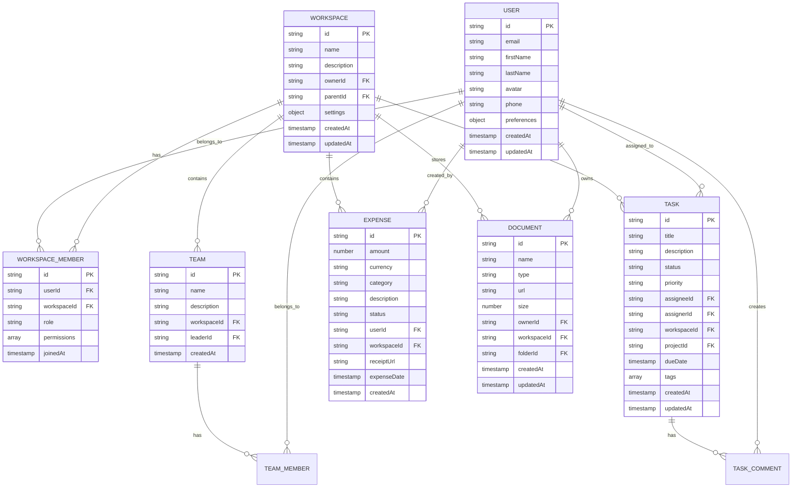

# 🏗️ SPT Teams Mobile App - Technical Architecture Document

## 1. Architecture Design


## 2. Technology Description

* **Frontend**: React Native 0.73+ with TypeScript 5.0+, React Navigation 6 for navigation, React Query for server state

* **State Management**: Zustand for global state, React Context for theme/auth, AsyncStorage for local persistence

* **UI Framework**: NativeBase 3.4+ with custom theme, React Native Reanimated 3 for animations

* **Backend**: Firebase (Firestore, Auth, Storage, Cloud Functions), Google Generative AI for AI features

* **Development**: Expo CLI 49+, Metro bundler, Flipper for debugging, ESLint + Prettier for code quality

* **Testing**: Jest for unit tests, Detox for E2E testing, React Native Testing Library for component tests

* **Build & Deploy**: EAS Build for app compilation, CodePush for OTA updates, Fastlane for CI/CD

## 3. Route Definitions

| Route                 | Purpose                            | Authentication Required |
| --------------------- | ---------------------------------- | ----------------------- |
| /auth/login           | User authentication and login      | No                      |
| /auth/register        | New user registration              | No                      |
| /auth/forgot-password | Password reset flow                | No                      |
| /auth/onboarding      | First-time user setup              | Yes                     |
| /dashboard            | Main dashboard and overview        | Yes                     |
| /workspaces           | Workspace management and switching | Yes                     |
| /workspaces/:id       | Individual workspace details       | Yes                     |
| /teams                | Team directory and collaboration   | Yes                     |
| /teams/:id            | Individual team details            | Yes                     |
| /tasks                | Task and project management        | Yes                     |
| /tasks/:id            | Individual task details            | Yes                     |
| /projects/:id         | Project overview and timeline      | Yes                     |
| /financial            | Financial management dashboard     | Yes                     |
| /financial/expenses   | Expense tracking and submission    | Yes                     |
| /financial/budgets    | Budget management                  | Yes                     |
| /hr                   | Human resources dashboard          | Yes                     |
| /hr/employees         | Employee directory                 | Yes                     |
| /hr/attendance        | Attendance tracking                | Yes                     |
| /hr/leave             | Leave management                   | Yes                     |
| /documents            | Document management                | Yes                     |
| /documents/:id        | Document viewer                    | Yes                     |
| /analytics            | Analytics dashboard                | Yes                     |
| /analytics/reports    | Custom reports                     | Yes                     |
| /ai-assistant         | AI assistant chat interface        | Yes                     |
| /calendar             | Calendar and scheduling            | Yes                     |
| /calendar/events/:id  | Event details                      | Yes                     |
| /communication/chats  | Messaging interface                | Yes                     |
| /communication/calls  | Video call interface               | Yes                     |
| /settings             | User settings and preferences      | Yes                     |
| /profile              | User profile management            | Yes                     |

## 4. API Definitions

### 4.1 Authentication APIs

**User Login**

```
POST /api/auth/login
```

Request:

| Param Name | Param Type | isRequired | Description                    |
| ---------- | ---------- | ---------- | ------------------------------ |
| email      | string     | true       | User email address             |
| password   | string     | true       | User password                  |
| deviceId   | string     | false      | Device identifier for tracking |

Response:

| Param Name   | Param Type | Description                       |
| ------------ | ---------- | --------------------------------- |
| success      | boolean    | Authentication status             |
| user         | object     | User profile data                 |
| token        | string     | JWT access token                  |
| refreshToken | string     | Refresh token for session renewal |

Example:

```json
{
  "email": "user@example.com",
  "password": "securePassword123",
  "deviceId": "device_uuid"
}
```

**User Registration**

```
POST /api/auth/register
```

Request:

| Param Name    | Param Type | isRequired | Description            |
| ------------- | ---------- | ---------- | ---------------------- |
| email         | string     | true       | User email address     |
| password      | string     | true       | User password          |
| firstName     | string     | true       | User first name        |
| lastName      | string     | true       | User last name         |
| workspaceName | string     | false      | Initial workspace name |

### 4.2 Workspace APIs

**Get User Workspaces**

```
GET /api/workspaces
```

Response:

| Param Name | Param Type | Description             |
| ---------- | ---------- | ----------------------- |
| workspaces | array      | List of user workspaces |
| totalCount | number     | Total workspace count   |

**Create Workspace**

```
POST /api/workspaces
```

Request:

| Param Name  | Param Type | isRequired | Description             |
| ----------- | ---------- | ---------- | ----------------------- |
| name        | string     | true       | Workspace name          |
| description | string     | false      | Workspace description   |
| parentId    | string     | false      | Parent workspace ID     |
| settings    | object     | false      | Workspace configuration |

### 4.3 Task Management APIs

**Get Tasks**

```
GET /api/tasks
```

Query Parameters:

| Param Name  | Param Type | Description         |
| ----------- | ---------- | ------------------- |
| workspaceId | string     | Filter by workspace |
| assigneeId  | string     | Filter by assignee  |
| status      | string     | Filter by status    |
| priority    | string     | Filter by priority  |
| page        | number     | Pagination page     |
| limit       | number     | Items per page      |

**Create Task**

```
POST /api/tasks
```

Request:

| Param Name  | Param Type | isRequired | Description           |
| ----------- | ---------- | ---------- | --------------------- |
| title       | string     | true       | Task title            |
| description | string     | false      | Task description      |
| assigneeId  | string     | false      | Assigned user ID      |
| dueDate     | string     | false      | Due date (ISO format) |
| priority    | string     | false      | Task priority level   |
| workspaceId | string     | true       | Workspace ID          |

### 4.4 Financial Management APIs

**Submit Expense**

```
POST /api/expenses
```

Request:

| Param Name  | Param Type | isRequired | Description         |
| ----------- | ---------- | ---------- | ------------------- |
| amount      | number     | true       | Expense amount      |
| currency    | string     | true       | Currency code       |
| category    | string     | true       | Expense category    |
| description | string     | false      | Expense description |
| receiptUrl  | string     | false      | Receipt image URL   |
| workspaceId | string     | true       | Workspace ID        |

**Get Budget Summary**

```
GET /api/budgets/summary
```

Query Parameters:

| Param Name  | Param Type | Description                      |
| ----------- | ---------- | -------------------------------- |
| workspaceId | string     | Workspace ID                     |
| period      | string     | Time period (month/quarter/year) |

### 4.5 AI Assistant APIs

**Chat with AI**

```
POST /api/ai/chat
```

Request:

| Param Name  | Param Type | isRequired | Description          |
| ----------- | ---------- | ---------- | -------------------- |
| message     | string     | true       | User message         |
| context     | object     | false      | Conversation context |
| workspaceId | string     | true       | Current workspace    |

Response:

| Param Name  | Param Type | Description           |
| ----------- | ---------- | --------------------- |
| response    | string     | AI response message   |
| suggestions | array      | Follow-up suggestions |
| actions     | array      | Actionable items      |

## 5. Server Architecture Diagram


## 6. Data Model

### 6.1 Data Model Definition



### 6.2 Data Definition Language

**Users Collection (Firestore)**

```javascript
// Collection: users
{
  id: "user_uuid",
  email: "user@example.com",
  firstName: "John",
  lastName: "Doe",
  avatar: "https://storage.url/avatar.jpg",
  phone: "+1234567890",
  preferences: {
    theme: "light", // light, dark, system
    notifications: {
      push: true,
      email: true,
      inApp: true
    },
    language: "en",
    timezone: "America/New_York"
  },
  deviceTokens: ["fcm_token_1", "fcm_token_2"],
  lastActive: Timestamp,
  createdAt: Timestamp,
  updatedAt: Timestamp
}

// Firestore Security Rules
rules_version = '2';
service cloud.firestore {
  match /databases/{database}/documents {
    match /users/{userId} {
      allow read, write: if request.auth != null && request.auth.uid == userId;
    }
  }
}
```

**Workspaces Collection (Firestore)**

```javascript
// Collection: workspaces
{
  id: "workspace_uuid",
  name: "Main Company",
  description: "Primary workspace for company operations",
  ownerId: "user_uuid",
  parentId: null, // or parent workspace ID for hierarchy
  settings: {
    currency: "USD",
    timezone: "America/New_York",
    features: {
      financial: true,
      hr: true,
      tasks: true,
      analytics: true,
      ai: true
    },
    branding: {
      logo: "https://storage.url/logo.png",
      primaryColor: "#3B82F6",
      secondaryColor: "#6B7280"
    }
  },
  stats: {
    memberCount: 25,
    taskCount: 150,
    activeProjects: 8
  },
  createdAt: Timestamp,
  updatedAt: Timestamp
}

// Firestore Security Rules
match /workspaces/{workspaceId} {
  allow read: if isWorkspaceMember(workspaceId);
  allow write: if isWorkspaceOwnerOrAdmin(workspaceId);
}
```

**Tasks Collection (Firestore)**

```javascript
// Collection: tasks
{
  id: "task_uuid",
  title: "Complete project proposal",
  description: "Create comprehensive proposal for Q2 project",
  status: "in_progress", // todo, in_progress, review, done, cancelled
  priority: "high", // low, medium, high, urgent
  assigneeId: "user_uuid",
  assignerId: "user_uuid",
  workspaceId: "workspace_uuid",
  projectId: "project_uuid",
  teamId: "team_uuid",
  dueDate: Timestamp,
  startDate: Timestamp,
  completedDate: null,
  tags: ["proposal", "urgent", "q2"],
  attachments: [
    {
      id: "attachment_uuid",
      name: "requirements.pdf",
      url: "https://storage.url/file.pdf",
      type: "application/pdf",
      size: 1024000
    }
  ],
  comments: [
    {
      id: "comment_uuid",
      userId: "user_uuid",
      message: "Updated the timeline section",
      createdAt: Timestamp
    }
  ],
  timeTracking: {
    estimatedHours: 8,
    loggedHours: 5.5,
    sessions: [
      {
        startTime: Timestamp,
        endTime: Timestamp,
        duration: 2.5
      }
    ]
  },
  createdAt: Timestamp,
  updatedAt: Timestamp
}

// Firestore Security Rules
match /tasks/{taskId} {
  allow read: if isWorkspaceMember(resource.data.workspaceId);
  allow create: if isWorkspaceMember(request.resource.data.workspaceId);
  allow update: if isTaskAssigneeOrCreator(taskId) || isWorkspaceAdmin(resource.data.workspaceId);
}
```

**Expenses Collection (Firestore)**

```javascript
// Collection: expenses
{
  id: "expense_uuid",
  amount: 125.50,
  currency: "USD",
  category: "travel", // travel, meals, office, software, other
  subcategory: "flight",
  description: "Flight to client meeting",
  status: "pending", // draft, pending, approved, rejected, reimbursed
  userId: "user_uuid",
  workspaceId: "workspace_uuid",
  projectId: "project_uuid",
  receiptUrl: "https://storage.url/receipt.jpg",
  receiptData: {
    vendor: "Airline Company",
    date: "2024-01-15",
    extractedText: "Flight receipt text...",
    confidence: 0.95
  },
  expenseDate: Timestamp,
  submittedDate: Timestamp,
  approvedDate: null,
  approvedBy: null,
  reimbursedDate: null,
  notes: "Business trip to close deal",
  mileage: {
    distance: 0,
    rate: 0.65,
    startLocation: "",
    endLocation: ""
  },
  createdAt: Timestamp,
  updatedAt: Timestamp
}

// Firestore Security Rules
match /expenses/{expenseId} {
  allow read: if isExpenseOwner(expenseId) || isWorkspaceAdmin(resource.data.workspaceId);
  allow create: if isWorkspaceMember(request.resource.data.workspaceId);
  allow update: if isExpenseOwner(expenseId) || canApproveExpenses(resource.data.workspaceId);
}
```

**Documents Collection (Firestore)**

```javascript
// Collection: documents
{
  id: "document_uuid",
  name: "Project Requirements.pdf",
  type: "application/pdf",
  url: "https://storage.url/document.pdf",
  thumbnailUrl: "https://storage.url/thumbnail.jpg",
  size: 2048000,
  ownerId: "user_uuid",
  workspaceId: "workspace_uuid",
  folderId: "folder_uuid",
  teamId: "team_uuid",
  projectId: "project_uuid",
  permissions: {
    public: false,
    allowedUsers: ["user1_uuid", "user2_uuid"],
    allowedRoles: ["admin", "member"]
  },
  metadata: {
    description: "Project requirements document",
    tags: ["requirements", "project", "documentation"],
    version: "1.2",
    language: "en"
  },
  versions: [
    {
      id: "version_uuid",
      url: "https://storage.url/document_v1.pdf",
      uploadedBy: "user_uuid",
      uploadedAt: Timestamp,
      changes: "Updated section 3.2"
    }
  ],
  downloadCount: 15,
  lastAccessed: Timestamp,
  createdAt: Timestamp,
  updatedAt: Timestamp
}

// Firestore Security Rules
match /documents/{documentId} {
  allow read: if hasDocumentAccess(documentId);
  allow create: if isWorkspaceMember(request.resource.data.workspaceId);
  allow update: if isDocumentOwner(documentId) || isWorkspaceAdmin(resource.data.workspaceId);
}
```

**Cloud Functions for Security Rules**

```TypeScript
// Helper functions for Firestore security rules
function isWorkspaceMember(workspaceId) {
  return exists(/databases/$(database)/documents/workspaces/$(workspaceId)/members/$(request.auth.uid));
}

function isWorkspaceAdmin(workspaceId) {
  return get(/databases/$(database)/documents/workspaces/$(workspaceId)/members/$(request.auth.uid)).data.role in ['admin', 'owner'];
}

function isTaskAssigneeOrCreator(taskId) {
  let task = resource.data;
  return request.auth.uid == task.assigneeId || request.auth.uid == task.assignerId;
}

function hasDocumentAccess(documentId) {
  let doc = resource.data;
  return doc.permissions.public == true || 
         request.auth.uid in doc.permissions.allowedUsers ||
         isWorkspaceMember(doc.workspaceId);
}
```

## 7. Mobile-Specific Implementation

### 7.1 Native Module Integration

**Camera and Media**

```typescript
// services/CameraService.ts
import { launchImageLibrary, launchCamera } from 'react-native-image-picker';
import DocumentScanner from 'react-native-document-scanner-plugin';

export class CameraService {
  static async captureReceipt(): Promise<string> {
    const result = await DocumentScanner.scanDocument();
    return result.scannedImages[0];
  }
  
  static async capturePhoto(): Promise<string> {
    const result = await launchCamera({ mediaType: 'photo', quality: 0.8 });
    return result.assets[0].uri;
  }
}
```

**Biometric Authentication**

```typescript
// services/BiometricService.ts
import TouchID from 'react-native-touch-id';

export class BiometricService {
  static async isSupported(): Promise<boolean> {
    try {
      await TouchID.isSupported();
      return true;
    } catch {
      return false;
    }
  }
  
  static async authenticate(): Promise<boolean> {
    try {
      await TouchID.authenticate('Authenticate to access SPT Teams');
      return true;
    } catch {
      return false;
    }
  }
}
```

**Location Services**

```typescript
// services/LocationService.ts
import Geolocation from '@react-native-community/geolocation';

export class LocationService {
  static async getCurrentLocation(): Promise<{latitude: number, longitude: number}> {
    return new Promise((resolve, reject) => {
      Geolocation.getCurrentPosition(
        position => resolve({
          latitude: position.coords.latitude,
          longitude: position.coords.longitude
        }),
        error => reject(error),
        { enableHighAccuracy: true, timeout: 15000, maximumAge: 10000 }
      );
    });
  }
}
```

### 7.2 Offline Functionality

**Offline Storage Strategy**

```typescript
// services/OfflineService.ts
import AsyncStorage from '@react-native-async-storage/async-storage';
import NetInfo from '@react-native-community/netinfo';

export class OfflineService {
  private static OFFLINE_QUEUE_KEY = 'offline_queue';
  
  static async queueAction(action: OfflineAction): Promise<void> {
    const queue = await this.getOfflineQueue();
    queue.push({ ...action, timestamp: Date.now() });
    await AsyncStorage.setItem(this.OFFLINE_QUEUE_KEY, JSON.stringify(queue));
  }
  
  static async processOfflineQueue(): Promise<void> {
    const isConnected = await NetInfo.fetch().then(state => state.isConnected);
    if (!isConnected) return;
    
    const queue = await this.getOfflineQueue();
    for (const action of queue) {
      try {
        await this.executeAction(action);
      } catch (error) {
        console.error('Failed to sync offline action:', error);
      }
    }
    
    await AsyncStorage.removeItem(this.OFFLINE_QUEUE_KEY);
  }
}
```

### 7.3 Push Notifications

**Notification Service**

```typescript
// services/NotificationService.ts
import messaging from '@react-native-firebase/messaging';
import PushNotification from 'react-native-push-notification';

export class NotificationService {
  static async initialize(): Promise<void> {
    await messaging().requestPermission();
    const token = await messaging().getToken();
    await this.registerDeviceToken(token);
    
    messaging().onMessage(async remoteMessage => {
      this.showLocalNotification(remoteMessage);
    });
  }
  
  static async registerDeviceToken(token: string): Promise<void> {
    // Register token with backend
    await ApiService.post('/api/users/device-tokens', { token });
  }
  
  private static showLocalNotification(message: any): void {
    PushNotification.localNotification({
      title: message.notification.title,
      message: message.notification.body,
      playSound: true,
      soundName: 'default'
    });
  }
}
```

## 8. Performance Optimization

### 8.1 Code Splitting and Lazy Loading

```typescript
// navigation/AppNavigator.tsx
import { lazy } from 'react';

const DashboardScreen = lazy(() => import('../screens/DashboardScreen'));
const TasksScreen = lazy(() => import('../screens/TasksScreen'));
const FinancialScreen = lazy(() => import('../screens/FinancialScreen'));

// Implement screen-based code splitting
const AppNavigator = () => {
  return (
    <NavigationContainer>
      <Stack.Navigator>
        <Stack.Screen 
          name="Dashboard" 
          component={DashboardScreen}
          options={{ lazy: true }}
        />
        {/* Other screens */}
      </Stack.Navigator>
    </NavigationContainer>
  );
};
```

### 8.2 Memory Management

```typescript
// hooks/useMemoryOptimization.ts
import { useEffect, useCallback } from 'react';
import { AppState } from 'react-native';

export const useMemoryOptimization = () => {
  const clearCache = useCallback(() => {
    // Clear image cache
    // Clear API cache
    // Clear temporary data
  }, []);
  
  useEffect(() => {
    const handleAppStateChange = (nextAppState: string) => {
      if (nextAppState === 'background') {
        clearCache();
      }
    };
    
    AppState.addEventListener('change', handleAppStateChange);
    return () => AppState.removeEventListener('change', handleAppStateChange);
  }, [clearCache]);
};
```

## 9. Security Implementation

### 9.1 Secure Storage

```typescript
// services/SecureStorageService.ts
import { MMKV } from 'react-native-mmkv';
import CryptoJS from 'crypto-js';

export class SecureStorageService {
  private static storage = new MMKV({ id: 'spt-teams-secure' });
  private static encryptionKey = 'your-encryption-key';
  
  static setSecureItem(key: string, value: string): void {
    const encrypted = CryptoJS.AES.encrypt(value, this.encryptionKey).toString();
    this.storage.set(key, encrypted);
  }
  
  static getSecureItem(key: string): string | null {
    const encrypted = this.storage.getString(key);
    if (!encrypted) return null;
    
    const decrypted = CryptoJS.AES.decrypt(encrypted, this.encryptionKey);
    return decrypted.toString(CryptoJS.enc.Utf8);
  }
}
```

### 9.2 API Security

```typescript
// services/ApiService.ts
import axios from 'axios';
import { SecureStorageService } from './SecureStorageService';

class ApiService {
  private api = axios.create({
    baseURL: 'https://api.sptteams.com',
    timeout: 10000
  });
  
  constructor() {
    this.setupInterceptors();
  }
  
  private setupInterceptors(): void {
    this.api.interceptors.request.use(config => {
      const token = SecureStorageService.getSecureItem('auth_token');
      if (token) {
        config.headers.Authorization = `Bearer ${token}`;
      }
      return config;
    });
    
    this.api.interceptors.response.use(
      response => response,
      error => {
        if (error.response?.status === 401) {
          this.handleUnauthorized();
        }
        return Promise.reject(error);
      }
    );
  }
}
```

This technical architecture document provides a comprehensive foundation for implementing the SPT Teams mobile application using React Native, with detailed specifications for Firebase integration, security measures, performance optimization, and mobile-specific features.
