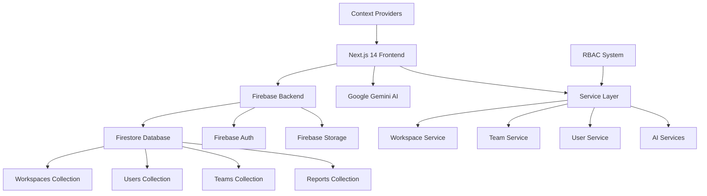

# 🚀 SPT Teams - Enterprise Workspace Management Platform

<div align="center">


**A comprehensive, enterprise-grade workspace management platform with hierarchical multi-workspace support, advanced RBAC, and AI-powered insights.**

[](https://nextjs.org/)
[](https://www.typescriptlang.org/)
[](https://firebase.google.com/)
[](https://reactjs.org/)
[](https://tailwindcss.com/)
[](https://ai.google.dev/)

[🌟 Features](#-enterprise-features) •
[🚀 Quick Start](#-quick-start) •
[📚 Documentation](#-documentation) •
[🏗️ Architecture](#️-system-architecture) •
[🤝 Contributing](#-contributing)

</div>

---

## 📖 Table of Contents

- [🌟 Enterprise Features](#-enterprise-features)
- [💰 Financial Management Suite](#-financial-management-suite)
- [🏛️ Human Resources Management](#️-human-resources-management)
- [🏗️ System Architecture](#️-system-architecture)
- [🚀 Quick Start](#-quick-start)
- [📦 Project Structure](#-project-structure)
- [🔧 Configuration](#-configuration)
- [🧪 Development](#-development)
- [📊 Analytics & AI](#-analytics--ai)
- [🔒 Security Features](#-security-features)
- [🚀 Deployment](#-deployment)
- [📚 Documentation](#-documentation)
- [🤝 Contributing](#-contributing)
- [📝 License](#-license)

---

## 🌟 Enterprise Features

### 🏢 **Hierarchical Multi-Workspace Management**
- **🌳 Workspace Hierarchy**: Main workspaces with unlimited sub-workspaces
- **🔄 Workspace Switching**: Seamless navigation between multiple workspaces for owners
- **📍 Geographic Binding**: Sub-workspaces bound to specific regions and branches
- **👑 Cross-Workspace Access**: Main workspace owners can manage all related workspaces
- **⚡ Inheritance System**: Permissions, users, and settings cascade down the hierarchy

### 🛡️ **Advanced Role-Based Access Control (RBAC)**
- **👤 Hierarchical Roles**: Owner → Admin → Member with granular permissions
- **🎯 Feature-Based Permissions**: 80+ granular permissions across all features
- **🔗 Permission Inheritance**: Automated permission cascading through workspace hierarchy
- **🚪 Context-Aware Access**: Different access levels based on workspace context
- **📋 Permission Templates**: Pre-configured role templates for quick setup

### 👥 **Intelligent Team Management**
- **🏆 System-Wide Team View**: Main workspace owners see teams across all workspaces
- **📊 Role-Based Visibility**: Members see only their teams, admins see workspace teams
- **👨‍💼 Team Lead Assignment**: Hierarchical team leadership with delegation capabilities
- **🔄 Cross-Workspace Teams**: Teams can span multiple workspaces with proper access control
- **📈 Team Analytics**: AI-powered team performance insights and recommendations

### 📊 **Dynamic Reporting & Analytics**
- **🎨 Visual Report Builder**: Drag-and-drop interface for custom report templates
- **📈 Real-Time Dashboard**: Interactive charts with live data updates
- **📁 Multi-Format Export**: PDF, Excel, CSV exports with custom layouts
- **✅ Approval Workflows**: Multi-stage approval process with notification chains
- **🤖 AI-Generated Insights**: Automated analysis and trend identification
- **📅 Scheduled Reports**: Automated report generation and distribution

### 🗂️ **Enterprise Document Management**
- **📚 Hierarchical Folders**: Nested folder structure with inherited permissions
- **🔐 Secure File Sharing**: Access controls with expiration dates and audit trails
- **📝 Version Control**: Complete document history and change tracking
- **⚡ Bulk Operations**: Efficient mass file operations and organizational tools
- **🔍 Advanced Search**: AI-powered document search and categorization

### � **Enterprise Financial Management**
- **💳 Comprehensive Expense Tracking**: Multi-currency expense management with receipt uploads
- **📊 Budget Management**: Department, project, and cost center budget tracking
- **🏢 Cost Center Analytics**: Detailed cost center performance analysis and forecasting
- **💱 Multi-Currency Support**: Real-time currency conversion and reporting
- **📈 Financial Reporting**: Advanced financial analytics with export capabilities
- **🔍 Budget Variance Analysis**: AI-powered budget vs. actual spending insights

### 👥 **Advanced HR Management System**
- **🎯 Recruitment & Hiring**: Complete recruitment pipeline with job posting and candidate tracking
- **📋 Interview Management**: Structured interview scheduling with feedback and rating systems
- **🏢 Onboarding Management**: Streamlined employee onboarding process automation
- **📅 Leave Management**: Comprehensive leave tracking with balance management and approval workflows
- **⏰ Attendance Tracking**: Digital attendance system with clock-in/out and break tracking
- **💰 Payroll Management**: Complete payroll system with salary calculations and payslip generation
- **📊 HR Analytics**: Employee performance insights and workforce analytics

### �📅 **Comprehensive Calendar & Task System**
- **🎯 Smart Task Assignment**: Role-based task delegation with priority management
- **⏰ Deadline Intelligence**: Visual deadline tracking with automated notifications
- **🔄 Recurring Events**: Advanced recurring patterns for meetings and tasks
- **📱 Mobile-First Design**: Responsive interface optimized for all devices
- **🔔 Smart Notifications**: Context-aware notifications with role-based filtering

### 🤖 **AI-Powered Intelligence**
- **💬 AI Assistant**: Google Gemini-powered assistant for workspace insights
- **📊 Predictive Analytics**: AI-driven trend analysis and forecasting
- **🎯 Smart Recommendations**: Contextual suggestions for optimization
- **🔍 Natural Language Queries**: Ask questions about your data in plain English
- **📈 Performance Insights**: AI analysis of team productivity and engagement

### 🔒 **Enterprise-Grade Security**
- **🔐 Multi-Factor Authentication**: SMS and email-based MFA with social login support
- **🛡️ Firebase Security Rules**: Comprehensive Firestore and Storage security
- **📝 Audit Trails**: Complete activity logging for compliance and monitoring
- **🔒 Data Encryption**: End-to-end encryption for sensitive data
- **⚡ Performance Optimization**: Advanced caching and query optimization
- **🌐 GDPR Compliance**: Privacy-first design with data protection features

---

## 💰 Financial Management Suite

### **Comprehensive Expense Management**
- **💳 Multi-Currency Expense Tracking**: Support for global operations with real-time currency conversion
- **📁 Receipt Management**: Upload and organize expense receipts with OCR capabilities
- **🏢 Department & Project Allocation**: Assign expenses to specific departments, projects, or cost centers
- **✅ Approval Workflows**: Multi-level expense approval process with notification chains
- **📊 Expense Analytics**: Real-time spending insights and trend analysis

### **Advanced Budget Control**
- **🎯 Budget Planning**: Create department, project, and cost center budgets
- **📈 Budget Tracking**: Monitor spending against allocations with real-time updates
- **⚠️ Alert Systems**: Automated notifications for budget thresholds and overruns
- **📊 Variance Analysis**: Compare planned vs. actual spending with detailed reports
- **🔍 Cost Center Management**: Detailed cost center analytics and performance tracking

### **Financial Reporting & Analytics**
- **📋 Dynamic Reports**: Build custom financial reports with drag-and-drop interface
- **📈 Performance Dashboards**: Real-time financial KPIs and metrics visualization
- **📊 Forecasting**: AI-powered budget forecasting and trend prediction
- **📤 Export Capabilities**: Export reports in multiple formats (PDF, Excel, CSV)
- **🔍 Drill-Down Analysis**: Detailed expense breakdowns and category analysis

---

## 🏛️ Human Resources Management

### **Complete Recruitment Pipeline**
- **📝 Job Posting Management**: Create and manage job advertisements across multiple platforms
- **🌐 Public Job Board**: Dedicated careers page for external candidates (`/careers`)
- **👥 Candidate Tracking**: Comprehensive applicant tracking system with status management
- **🎯 Hiring Pipeline**: Customizable recruitment stages with drag-and-drop candidate management
- **📊 Recruitment Analytics**: Track application rates, time-to-hire, and conversion metrics

### **Interview & Selection Process**
- **📅 Interview Scheduling**: Calendar integration with automated notifications
- **💻 Video Interview Support**: Integration with meeting platforms for remote interviews
- **📝 Feedback Management**: Structured interview feedback forms with rating systems
- **🎯 Candidate Scoring**: Standardized evaluation criteria and scoring mechanisms
- **📊 Interview Analytics**: Performance tracking and interviewer effectiveness metrics

### **Employee Onboarding**
- **✅ Onboarding Checklists**: Automated onboarding task management
- **📋 Document Collection**: Digital document submission and verification
- **🎯 Role Assignment**: Automatic role and permission setup for new hires
- **📧 Welcome Workflows**: Automated welcome emails and orientation scheduling
- **📊 Progress Tracking**: Monitor onboarding completion and engagement

### **Attendance & Time Management**
- **⏰ Digital Clock-In/Out**: Web-based attendance tracking system
- **📍 Location Tracking**: Optional location verification for attendance records
- **🕰️ Break Management**: Track break times and total work hours
- **📅 Shift Scheduling**: Flexible shift pattern configuration
- **📊 Attendance Analytics**: Attendance reports and trend analysis

### **Leave Management System**
- **📋 Leave Applications**: Digital leave request submission and tracking
- **✅ Approval Workflows**: Multi-level leave approval process
- **📊 Leave Balance Tracking**: Real-time leave balance management
- **📅 Calendar Integration**: Leave calendar with team visibility
- **📈 Leave Analytics**: Usage patterns and balance forecasting

### **Comprehensive Payroll**
- **💰 Salary Management**: Configure salaries, allowances, and deductions
- **📊 Payroll Processing**: Automated payroll calculation and generation
- **📄 Payslip Generation**: Digital payslips with detailed breakdown
- **💳 Payment Integration**: Integration with payment systems and banks
- **📊 Payroll Reports**: Comprehensive payroll analytics and compliance reports

---

## 🏗️ System Architecture

SPT Teams is built on a modern, scalable architecture designed for enterprise use:



### **Core Technology Stack**

| Layer | Technology | Purpose |
|-------|------------|---------|
| **Frontend** | Next.js 14, React 18, TypeScript | Modern React framework with App Router |
| **UI/UX** | Tailwind CSS, shadcn/ui, Radix UI | Mobile-first responsive design |
| **Backend** | Firebase (Firestore, Auth, Storage) | Scalable serverless backend |
| **AI Engine** | Google Gemini AI | Intelligent insights and automation |
| **State Management** | React Context | Auth, workspace, theme management |
| **Forms & Validation** | React Hook Form, Zod | Type-safe form handling |
| **Development** | TypeScript, ESLint, Firebase Emulators | Developer experience and testing |

### **Service Layer Architecture**

```typescript
// Example service pattern used throughout the platform
export class ServiceName {
  static async methodName(
    primaryId: string, 
    userId: string, 
    optionalData?: DataType
  ): Promise<ReturnType> {
    // RBAC permission checks
    // Business logic implementation
    // Firebase operations with error handling
    // Activity logging for audit trails
  }
}
```

### **Database Schema Overview**

```
Firebase Collections:
├── workspaces/           # Workspace hierarchy and settings
├── userWorkspaces/       # User-workspace relationships with roles
├── teams/               # Team data with workspace scoping
├── users/               # User profiles with hierarchical fields
├── departments/         # Organizational departments
├── branches/           # Geographic branch locations
├── regions/            # Regional organizational units
├── reports/            # Dynamic reports and templates
├── folders/            # Document management
├── tasks/              # Task and project management
├── activities/         # Audit trail and activity logs
│
├── 💰 Financial Management Collections:
├── expenses/           # Expense tracking and management
├── budgets/            # Budget allocations and tracking
├── costCenters/        # Cost center definitions and analytics
├── financialReports/   # Financial report templates and data
│
└── 🏛️ HR Management Collections:
    ├── jobPostings/        # Job advertisements and descriptions
    ├── candidates/         # Job applicants and their data
    ├── interviews/         # Interview scheduling and feedback
    ├── hiringPipelines/    # Recruitment workflow stages
    ├── attendanceRecords/  # Employee attendance tracking
    ├── leaveRequests/      # Leave applications and approvals
    ├── leaveTypes/         # Leave categories and policies
    ├── leaveBalances/      # Employee leave balances
    ├── payrollEmployees/   # Employee payroll information
    ├── payslips/          # Generated payslips
    └── payrollPeriods/    # Payroll processing periods
```

### **🎯 Key Integration Features**

- **🔄 Unified Data Flow**: Seamless integration between HR, Financial, and Workspace management
- **📊 Cross-Module Analytics**: Unified reporting across all business functions
- **🔐 Consistent RBAC**: Single permission system across all modules
- **📱 Mobile-Responsive**: All HR and Financial features optimized for mobile use
- **🌐 Multi-Workspace Support**: HR and Financial data scoped to workspace hierarchy
- **🤖 AI-Enhanced**: AI insights across recruitment, budget forecasting, and expense optimization
- **📧 Automated Workflows**: Email notifications for approvals, leave requests, and budget alerts
- **📈 Real-Time Updates**: Live dashboards with instant data synchronization

---

## 🚀 Quick Start

### **Prerequisites**

- **Node.js** v18.0 or higher
- **npm** or **yarn** package manager
- **Firebase Project** with Firestore, Authentication, and Storage enabled
- **Google Gemini API Key** (optional, for AI features)

### **Installation**

1. **Clone the repository**
   ```bash
   git clone https://github.com/Redemption19/Spt_teams.git
   cd Spt_teams
   ```

2. **Install dependencies**
   ```bash
   npm install
   # or
   yarn install
   ```

3. **Environment Setup**
   ```bash
   cp .env.example .env.local
   ```
   
   Configure your environment variables:
   ```env
   # Firebase Configuration
   NEXT_PUBLIC_FIREBASE_API_KEY=your_api_key
   NEXT_PUBLIC_FIREBASE_AUTH_DOMAIN=your_auth_domain
   NEXT_PUBLIC_FIREBASE_PROJECT_ID=your_project_id
   NEXT_PUBLIC_FIREBASE_STORAGE_BUCKET=your_storage_bucket
   NEXT_PUBLIC_FIREBASE_MESSAGING_SENDER_ID=your_sender_id
   NEXT_PUBLIC_FIREBASE_APP_ID=your_app_id
   
   # AI Configuration (Optional)
   GEMINI_API_KEY=your_gemini_api_key
   
   # Email Configuration (EmailJS)
   EMAILJS_SERVICE_ID=your_emailjs_service_id
   EMAILJS_TEMPLATE_ID=your_emailjs_template_id
   EMAILJS_PUBLIC_KEY=your_emailjs_public_key
   ```

4. **Firebase Setup**
   ```bash
   # Install Firebase CLI
   npm install -g firebase-tools
   
   # Login to Firebase
   firebase login
   
   # Initialize Firebase (if needed)
   firebase init
   ```

5. **Database Migration & Setup**
   ```bash
   # Deploy Firestore rules and indexes
   firebase deploy --only firestore:rules
   firebase deploy --only firestore:indexes
   
   # Deploy storage rules
   firebase deploy --only storage
   ```

6. **Start Development Server**
   ```bash
   # Start with Firebase emulators (recommended for development)
   npm run dev:emulator
   
   # Or start Next.js only
   npm run dev
   ```

   Open [http://localhost:3000](http://localhost:3000) in your browser.

### **🧪 Development with Emulators**

For the best development experience, use Firebase emulators:

```bash
# Start emulators with UI
npm run emulator:ui

# Export emulator data
npm run emulator:export

# Import saved data
npm run emulator:import
```

---

## 📦 Project Structure

```
SPT_Teams/
├── 📁 app/                    # Next.js 14 App Router
│   ├── 🔐 (auth)/            # Authentication routes
│   ├── 📊 dashboard/          # Main dashboard pages
│   ├── 🚀 onboarding/        # User onboarding flow
│   ├── 📱 (marketing)/       # Marketing and landing pages
│   └── globals.css           # Global styles
│
├── 🧩 components/            # Reusable UI components
│   ├── 🔐 auth/             # Authentication components
│   ├── 📊 dashboard/        # Dashboard widgets and charts
│   ├── 📋 reports/          # Report management interface
│   ├── 📅 calendar/         # Calendar and event components
│   ├── 📁 folders/          # File management interface
│   ├── 👥 teams/            # Team management components
│   ├── 💰 financial/        # Financial management components
│   ├── 🏛️ hr/               # HR management system
│   │   ├── 🎯 recruitment/  # Job posting and hiring pipeline
│   │   ├── 📅 attendance/   # Attendance tracking system
│   │   ├── 🏖️ leave/        # Leave management system
│   │   └── 💰 payroll/      # Payroll management system
│   ├── 🤖 ai-assistant/     # AI chat interface
│   ├── ⚙️ settings/         # Settings and configuration
│   └── 🎨 ui/               # Base shadcn/ui components
│
├── 🔧 lib/                   # Business logic and utilities
│   ├── 📊 analytics-service.ts     # Analytics and reporting
│   ├── 🤖 ai-*.ts                  # AI integration services
│   ├── 🏢 workspace-service.ts     # Workspace management
│   ├── 👥 team-service.ts          # Team operations
│   ├── 👤 user-service.ts          # User management
│   ├── � financial-*.ts           # Financial management services
│   │   ├── budget-tracking-service.ts    # Budget and cost centers
│   │   ├── expense-management-service.ts # Expense tracking
│   │   └── financial-reports-service.ts  # Financial analytics
│   ├── 🏛️ hr-services/              # HR management services
│   │   ├── recruitment-service.ts        # Job postings and hiring
│   │   ├── attendance-service.ts         # Attendance tracking
│   │   ├── leave-service.ts              # Leave management
│   │   └── payroll-service.ts            # Payroll processing
│   ├── �🛡️ permissions-service.ts   # RBAC system
│   ├── 🔐 auth-context.tsx         # Authentication context
│   ├── 🏢 workspace-context.tsx    # Workspace state management
│   ├── 🎨 theme-context.tsx        # Theme management
│   ├── 📄 types.ts                 # TypeScript definitions
│   ├── 🔧 utils.ts                 # Utility functions
│   └── 🔥 firebase.ts              # Firebase configuration
│
├── 🎣 hooks/                 # Custom React hooks
│   ├── use-permissions.ts    # Permission checking hooks
│   ├── use-currency.ts       # Currency management
│   └── use-toast.ts          # Notification system
│
├── 📁 public/                # Static assets
│   └── images/               # Image assets
│
├── 📚 docs/                  # Documentation
│   ├── API_GUIDE.md          # API documentation
│   ├── DEPLOYMENT.md         # Deployment instructions
│   └── SECURITY.md           # Security guidelines
│
├── 🏗️ Infrastructure Files
│   ├── package.json          # Dependencies and scripts
│   ├── next.config.js        # Next.js configuration
│   ├── tailwind.config.ts    # Tailwind CSS configuration
│   ├── tsconfig.json         # TypeScript configuration
│   ├── firebase.json         # Firebase configuration
│   ├── firestore.rules       # Firestore security rules
│   └── firestore.indexes.json # Database indexes
│
└── 📋 Documentation Files
    ├── README.md             # This file
    ├── ROADMAP.md            # Development roadmap
    ├── SECURITY.md           # Security documentation
    └── CONTRIBUTING.md       # Contribution guidelines
```

---

## 🔧 Configuration

### **Firebase Configuration**

1. **Create a Firebase Project**
   - Go to [Firebase Console](https://console.firebase.google.com/)
   - Create a new project or use existing
   - Enable Firestore, Authentication, and Storage

2. **Configure Authentication**
   ```bash
   # Enable sign-in methods in Firebase Console:
   # - Email/Password
   # - Google (optional)
   # - Anonymous (for guest access)
   ```

3. **Set up Firestore Indexes**
   ```bash
   # Deploy the required indexes
   firebase deploy --only firestore:indexes
   ```

### **Environment Variables**

Create `.env.local` with these required variables:

```env
# Firebase (Required)
NEXT_PUBLIC_FIREBASE_API_KEY=
NEXT_PUBLIC_FIREBASE_AUTH_DOMAIN=
NEXT_PUBLIC_FIREBASE_PROJECT_ID=
NEXT_PUBLIC_FIREBASE_STORAGE_BUCKET=
NEXT_PUBLIC_FIREBASE_MESSAGING_SENDER_ID=
NEXT_PUBLIC_FIREBASE_APP_ID=

# AI Features (Optional)
GEMINI_API_KEY=

# Email Service (Required for notifications)
EMAILJS_SERVICE_ID=
EMAILJS_TEMPLATE_ID=
EMAILJS_PUBLIC_KEY=

# Development (Optional)
NODE_ENV=development
```

### **Firestore Security Rules**

The platform includes comprehensive security rules. Deploy them with:

```bash
firebase deploy --only firestore:rules
```

---

## 🧪 Development

### **Available Scripts**

```bash
# Development
npm run dev                 # Start Next.js development server
npm run dev:emulator        # Start with Firebase emulators

# Production
npm run build              # Build for production
npm run start              # Start production server

# Firebase Emulators
npm run emulator           # Start Firebase emulators
npm run emulator:ui        # Start emulators with web UI
npm run emulator:export    # Export emulator data
npm run emulator:import    # Import saved emulator data

# Code Quality
npm run lint               # Run ESLint
npm run type-check         # TypeScript type checking
```

### **Development Workflow**

1. **Feature Development**
   ```bash
   # Create feature branch
   git checkout -b feature/your-feature-name
   
   # Start development environment
   npm run dev:emulator
   ```

2. **Code Quality Standards**
   - **TypeScript**: Strict mode enabled
   - **ESLint**: Enforced code standards
   - **Prettier**: Consistent formatting
   - **Component Patterns**: Follow existing patterns

3. **Testing Strategy**
   ```bash
   # Manual testing with emulators
   npm run emulator:ui
   
   # Test different user roles
   # - Create test workspaces
   # - Test permission inheritance
   # - Verify RBAC functionality
   ```

### **Key Development Patterns**

#### **Service Layer Pattern**
```typescript
// All business logic follows this pattern
export class ServiceName {
  static async methodName(params: ParamType): Promise<ReturnType> {
    // 1. Permission checks
    // 2. Data validation
    // 3. Business logic
    // 4. Firebase operations
    // 5. Error handling
    // 6. Activity logging
  }
}
```

#### **RBAC Integration**
```typescript
// Always check permissions before rendering
const permissions = usePermissions();
if (!permissions.canManageUsers) return null;

// Use service-layer permission checks
const canEdit = await UserService.canEditUser(userId, targetUserId);
```

#### **Responsive Design**
```typescript
// Mobile-first Tailwind classes
<div className="grid grid-cols-1 md:grid-cols-2 lg:grid-cols-3 gap-4">
  <Card className="p-4 hover:shadow-lg transition-shadow">
    {/* Content */}
  </Card>
</div>
```

---

## 📊 Analytics & AI

### **AI Integration Features**

- **🤖 Google Gemini Integration**: Advanced AI capabilities for insights
- **📈 Predictive Analytics**: Trend analysis and forecasting
- **💬 Natural Language Queries**: Ask questions about your data
- **🎯 Smart Recommendations**: AI-powered optimization suggestions
- **📊 Automated Insights**: AI-generated reports and analysis

### **Analytics Dashboard**

- **📈 Real-Time Metrics**: Live workspace activity and performance
- **👥 Team Performance**: Productivity insights and trends
- **📊 Custom Reports**: Build reports with drag-and-drop interface
- **📱 Mobile Analytics**: Responsive charts and visualizations
- **📧 Scheduled Reports**: Automated report delivery

### **AI Service Architecture**

```typescript
// AI services follow layered architecture
import { AIDataService } from './ai-data-service';
import { DepartmentService } from './ai-services/department-service';

// Main orchestrator with backward compatibility
const insights = await AIDataService.getDepartmentInsights(workspaceId, userId);

// Specialized services for specific domains
const recommendations = await DepartmentService.getRecommendations(data);
```

---

## 🔒 Security Features

### **Authentication & Authorization**

- **🔐 Multi-Factor Authentication**: SMS and email-based MFA
- **🌐 Social Login**: Google, Microsoft, GitHub integration
- **👤 Role-Based Access Control**: Granular permission system
- **🔑 Secure Password Reset**: Email verification workflow
- **👻 Guest Access**: Secure anonymous access for demos

### **Data Protection**

- **🛡️ Firestore Security Rules**: Comprehensive database protection
- **🔒 Storage Security**: File access controls and permissions
- **📝 Audit Trails**: Complete activity logging for compliance
- **🔐 Data Encryption**: Secure sensitive data handling
- **📋 Input Validation**: Zod schema validation for all inputs

### **Compliance & Privacy**

- **🌐 GDPR Compliance**: Privacy-first design principles
- **📊 Activity Monitoring**: Real-time security monitoring
- **🔍 Permission Auditing**: Regular permission reviews
- **📱 Session Management**: Secure session handling
- **⚡ Rate Limiting**: API protection and abuse prevention

---

## 🚀 Deployment

### **Production Deployment**

1. **Build the Application**
   ```bash
   npm run build
   ```

2. **Deploy to Vercel (Recommended)**
   ```bash
   # Install Vercel CLI
   npm i -g vercel
   
   # Deploy
   vercel --prod
   ```

3. **Deploy Firebase Resources**
   ```bash
   # Deploy security rules and indexes
   firebase deploy --only firestore:rules,firestore:indexes,storage
   ```

### **Environment Configuration**

```bash
# Production environment variables
NEXT_PUBLIC_FIREBASE_PROJECT_ID=your-prod-project
NEXT_PUBLIC_FIREBASE_API_KEY=your-prod-api-key
# ... other production variables
```

### **Performance Optimization**

- **🚀 Next.js Optimization**: Automatic code splitting and optimization
- **📦 Bundle Analysis**: Optimized bundle size with tree shaking
- **🖼️ Image Optimization**: Automatic image optimization
- **⚡ Caching Strategy**: Intelligent caching for better performance
- **📱 Progressive Web App**: PWA features for mobile users

---

## 📚 Documentation

### **Available Guides**

- **📖 [User Guide](docs/USER_GUIDE.md)**: End-user documentation
- **🔧 [Admin Guide](docs/ADMIN_GUIDE.md)**: Administrator documentation
- **👩‍💻 [Developer Guide](docs/DEVELOPER_GUIDE.md)**: Development resources
- **🚀 [Deployment Guide](docs/DEPLOYMENT.md)**: Production deployment
- **🔒 [Security Guide](docs/SECURITY.md)**: Security best practices
- **🤖 [AI Integration Guide](docs/AI_INTEGRATION.md)**: AI features documentation
- **💰 [Financial Management Guide](docs/FINANCIAL_MANAGEMENT.md)**: Budget and expense tracking
- **🏛️ [HR Management Guide](docs/HR_MANAGEMENT.md)**: Recruitment, payroll, and attendance
- **🌐 [Public Job Board Guide](docs/PUBLIC_JOB_BOARD.md)**: External recruitment setup

### **API Documentation**

Complete API reference with examples:

```typescript
// Workspace Management
import { WorkspaceService } from '@/lib/workspace-service';

// Create a new workspace
const workspaceId = await WorkspaceService.createWorkspace({
  name: 'My Company',
  description: 'Main company workspace',
  ownerId: userId
}, userId);

// Financial Management
import { ExpenseManagementService } from '@/lib/expense-management-service';
import { BudgetTrackingService } from '@/lib/budget-tracking-service';

// Create an expense
const expenseId = await ExpenseManagementService.createExpense(workspaceId, {
  amount: 150.00,
  currency: 'USD',
  description: 'Business lunch',
  category: 'Meals',
  departmentId: 'dept-123'
}, userId);

// Create a cost center
const costCenterId = await BudgetTrackingService.createCostCenter(workspaceId, {
  name: 'Marketing Department',
  code: 'MKT-001',
  budget: 50000,
  budgetPeriod: 'quarterly'
});

// HR Management
import { RecruitmentService } from '@/lib/recruitment-service';
import { PayrollService } from '@/lib/payroll-service';

// Create a job posting
const jobId = await RecruitmentService.createJobPosting({
  title: 'Senior Developer',
  department: 'Engineering',
  workspaceId,
  status: 'active',
  salaryRange: { min: 80000, max: 120000, currency: 'USD' }
});

// Process payroll for an employee
const payslipId = await PayrollService.generatePayslip({
  employeeId: 'emp-123',
  workspaceId,
  period: '2024-01',
  baseSalary: 5000,
  allowances: { transport: 200, housing: 800 }
});
```

---

## 🤝 Contributing

We welcome contributions! Please see our [Contributing Guide](CONTRIBUTING.md) for details.

### **Development Workflow**

1. **Fork the repository**
2. **Create a feature branch**
   ```bash
   git checkout -b feature/amazing-feature
   ```
3. **Commit your changes**
   ```bash
   git commit -m 'Add amazing feature'
   ```
4. **Push to the branch**
   ```bash
   git push origin feature/amazing-feature
   ```
5. **Open a Pull Request**

### **Code Standards**

- **TypeScript**: Strict type checking enabled
- **ESLint**: Comprehensive linting rules
- **Prettier**: Consistent code formatting
- **Component Patterns**: Follow established patterns
- **Testing**: Write tests for new features

### **Contribution Guidelines**

- **🐛 Bug Reports**: Use GitHub Issues with detailed reproduction steps
- **✨ Feature Requests**: Discuss new features in GitHub Discussions
- **📝 Documentation**: Improve docs and add examples
- **🧪 Testing**: Add tests for new functionality
- **♿ Accessibility**: Ensure WCAG compliance

---

## 🆘 Support & Community

### **Getting Help**

- **📚 Documentation**: Check our comprehensive documentation
- **🐛 Issues**: Report bugs on [GitHub Issues](https://github.com/Redemption19/Spt_teams/issues)
- **💬 Discussions**: Join our [GitHub Discussions](https://github.com/Redemption19/Spt_teams/discussions)
- **📧 Email**: Contact support at support@spt-teams.com

### **Community Resources**

- **🎓 Tutorials**: Step-by-step implementation guides
- **📺 Video Guides**: Visual walkthrough of features
- **🎯 Best Practices**: Enterprise implementation patterns
- **🔧 Troubleshooting**: Common issues and solutions

### **FAQ**

<details>
<summary><strong>Q: How do I set up a new workspace hierarchy?</strong></summary>

1. Create a main workspace as an Owner
2. Navigate to Settings > Workspaces
3. Create sub-workspaces bound to regions/branches
4. Configure permission inheritance
5. Invite users with appropriate roles

</details>

<details>
<summary><strong>Q: Can I customize the permission system?</strong></summary>

Yes! The platform supports custom permissions:
- Use the Permission Builder in Settings
- Create custom role templates
- Configure feature-specific permissions
- Set up inheritance rules

</details>

<details>
<summary><strong>Q: How do I backup my workspace data?</strong></summary>

Use the built-in export features:
- Settings > Data Export for complete backup
- Individual feature exports (Reports, Folders, etc.)
- Automated backups via scheduled exports
- Firebase export tools for technical backups

</details>

---

## 📈 Roadmap

### **Current Phase: Enhanced Foundations (Phase 1)**
- ✅ Hierarchical user management
- ✅ Workspace-aware teams
- ✅ Enhanced RBAC system
- ✅ AI services architecture
- ✅ Cross-workspace data aggregation

### **Next Phase: Sub-Workspace UI (Phase 2)**
- 🚧 Sub-workspace creation interface
- 🚧 Workspace switching UI
- 🚧 Region/Branch binding interface
- 🚧 Data scoping enforcement
- 🚧 Cross-workspace authorization UI

### **Future Phases**
- **Phase 3**: Advanced reporting templates
- **Phase 4**: Mobile application
- **Phase 5**: API platform and integrations
- **Phase 6**: Enterprise SSO and advanced security

---

## 📝 License

This project is licensed under the MIT License - see the [LICENSE](LICENSE) file for details.

### **License Summary**

- ✅ Commercial use allowed
- ✅ Modification allowed
- ✅ Distribution allowed
- ✅ Private use allowed
- ❌ Warranty not provided
- ❌ Liability not accepted

---

## 🎉 Acknowledgments

### **Core Technologies**
- **[Next.js Team](https://nextjs.org/)**: For the amazing React framework
- **[Firebase Team](https://firebase.google.com/)**: For the robust backend services
- **[Vercel](https://vercel.com/)**: For the excellent deployment platform
- **[Google AI](https://ai.google.dev/)**: For Gemini AI integration

### **UI/UX Libraries**
- **[Tailwind CSS](https://tailwindcss.com/)**: For the utility-first CSS framework
- **[shadcn/ui](https://ui.shadcn.com/)**: For the excellent UI components
- **[Radix UI](https://www.radix-ui.com/)**: For accessible UI primitives
- **[Lucide Icons](https://lucide.dev/)**: For the beautiful icon set

### **Development Tools**
- **[TypeScript](https://www.typescriptlang.org/)**: For type safety
- **[ESLint](https://eslint.org/)**: For code quality
- **[Prettier](https://prettier.io/)**: For code formatting

---

<div align="center">

**Made with ❤️ by the SPT Teams Development Team**

[🌐 Website](https://spt-teams.com) •
[📖 Documentation](https://docs.spt-teams.com) •
[🐛 Report Bug](https://github.com/Redemption19/Spt_teams/issues) •
[💬 Discussions](https://github.com/Redemption19/Spt_teams/discussions)

---

⭐ **Star this repository if you find it helpful!** ⭐

</div>
